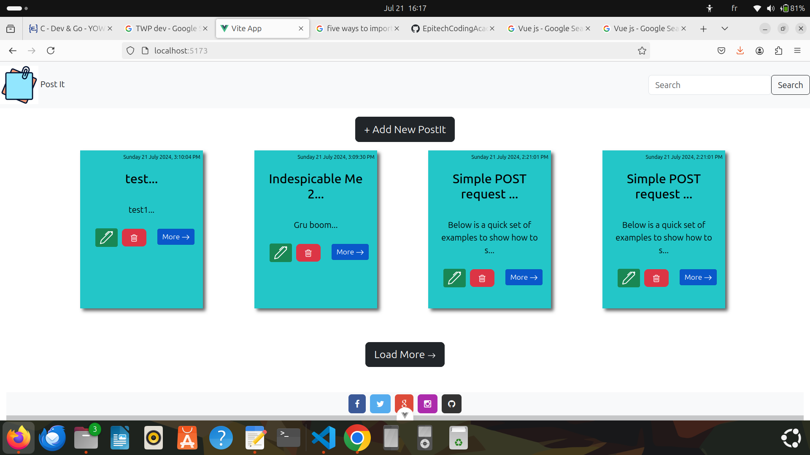
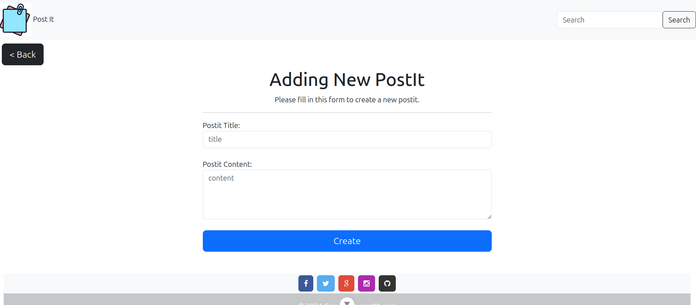
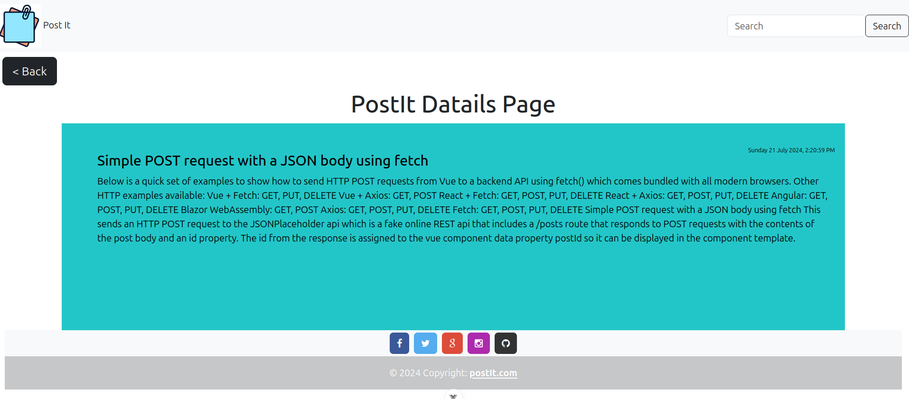

# Postit-project in Vue.js

## Overview
This  frontend project is a free publishing postit website that allows users to create, and browse online content. It is designed with Vue.js  using data from an API.  The website includes a home page containing all the postits, a page to add a new one and , a page to edit and a page to view details.
<div style= "display:flex"> 

</div> 


## Recommended IDE Setup

[VSCode](https://code.visualstudio.com/) + [Volar](https://marketplace.visualstudio.com/items?itemName=Vue.volar) (and disable Vetur).

The following steps help you setup and test this project.


## Customize configuration

See [Vite Configuration Reference](https://vitejs.dev/config/).

## Clone this project locally
```sh
git clone git@github.com:EpitechCodingAcademyPromo2024/C-DEV-121-COT-1-2-postit-toussaint.amoussouvi.git
```
## Project Setup

```sh
npm install
```

### Compile and Hot-Reload for Development

```sh
npm run dev
```

### Compile and Minify for Production

```sh
npm run build
```
<!-- 
### Run Unit Tests with [Vitest](https://vitest.dev/)

```sh
npm run test:unit
```

### Run End-to-End Tests with [Cypress](https://www.cypress.io/)

```sh
npm run test:e2e:dev
```

This runs the end-to-end tests against the Vite development server.
It is much faster than the production build.

But it's still recommended to test the production build with `test:e2e` before deploying (e.g. in CI environments):

```sh
npm run build
npm run test:e2e
```

### Lint with [ESLint](https://eslint.org/)

```sh
npm run lint
``` -->

- Home page
  

  

- Click load more to load more postit and load less to reduce the number of postit on the page
  

  

- New postit creation page 
  



- Postit details page 
  



### Find a bug?
If you find an issue or would like to submit an improvement to this project, please submit an issue using the issues tab above If you would like to submit a pull request with a fix, reference the issue you created!

### Known issues (work in progress)

- Perform CRUD operation with the store
- Search bar and filters for user friendly system
- Write unit-test for quality assurance 
- Deploy the website on a true server 
  


### Like this project?

If you are feeling generous, contact us! 

- toussaint.amoussouvi@epitech.eu


